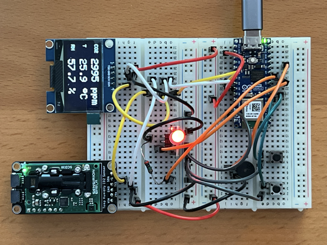
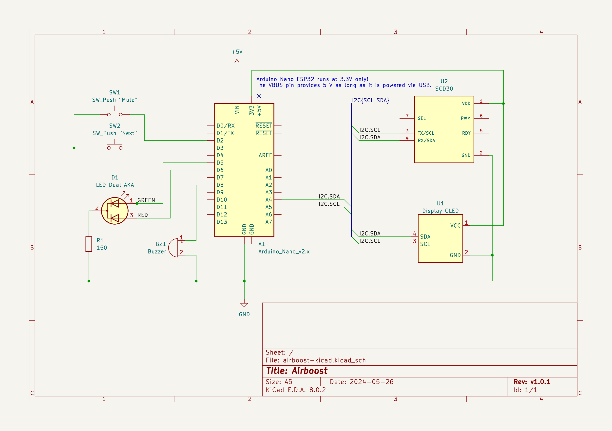

# Airboost

A device to monitor the Air Quality. It gives an audio-visual feedback given high levels of CO2.

## Motivation

Feeling dizzy while working on the computer for long periods. Not noticing the air getting bad. Forgetting to get fresh air by opening the windows.


## Get Started

1. Install PlatformIO https://platformio.org/
2. Clone Repo
3. Build `platformio run --environment release`
4. Connect Microcontoller via USB
5. Upload `platformio run --target upload --environment release`
6. Monitor `platformio run --target monitor --environment release`

Available Environments:

- `development` to create a development build, an active monitoring is required at startup, the code will wait for an active serial monitoring
- `release` to build and upload a standalone release build

## Components




### 1. The Microcontroller - Arduino Nano ESP32

The microcontroller reads and processes the sensor values. Based on the values it controls  the display, buzzer and led.
The Arduino Nano is one of the smallest controllers, best suited to cramp into a enclosure.
The ESP32 chip to eventually add wireless features, like sending metrics.

https://docs.arduino.cc/hardware/nano-esp32/


### 2. The Sensor - Sensirion SCD30 (NDIR C02 Sensor)

The sensor is used to measure the CO2 value, it also provides temperature and relative humidity readings.
The SCD30 sensor does not require a calibration and works out of the box.

https://sensirion.com/media/documents/4EAF6AF8/61652C3C/Sensirion_CO2_Sensors_SCD30_Datasheet.pdf

| Description     | Value                |
| --------------- | -------------------- |
| I2C-Address     | 0x61                 |
| Accuracy        | 400 ppm – 10’000 ppm |
| Update interval | 2 sec                |

For development the `Adafruit SCD30` is used. https://learn.adafruit.com/adafruit-scd30


### 3.1. Visual Output - Monochrome OLED Display

The display is used to display the sensor values.

https://www.az-delivery.de/en/products/1-3zoll-i2c-oled-display

| Description      | Value        |
| ---------------- | ------------ |
| Type             | SH1106       |
| Resolution       | 128x64 pixel |
| Size             | 1.3"         |
| Background Color | Black        |
| Text Color       | white        |
| I2C-Address      | 0x3C         |


### 3.2. Visual Output - Light indicator Red/Green

The Bicolor LED (Red/Green) is used to indicate the current CO2 values.

- Green: acceptable level of CO2
- Red: high level of CO2


### 3.3. Audio Output - Passive Buzzer

A passive buzzer requires a PWM signal to generate audio.

The Arduino tone library only supports AVR-based chips.
The ESP-32 libraries do not have a tone() function.
The LED Control (LEDC) function are able to generate a PWM for passive buzzers.

https://espressif-docs.readthedocs-hosted.com/projects/arduino-esp32/en/latest/api/ledc.html


### 4. Interactive input - Push Buttons

To interact with the device two push buttons are installed.

- "Mute"-Button is used to toggle the buzzer (active or mute)
- "Next"-Button is used to cycle through the available interfaces on the display

https://lastminuteengineers.com/handling-esp32-gpio-interrupts-tutorial/


## Schematics created with KiCad

https://github.com/ric03/airboost-kicad-schematics/



## Code quality with SonarLint Plugin

Linter to detect & fix coding issues locally.

The plugin requires `compileCommands` in order to scan the code (`compile_commands.json`).

Create the configuration file either with a PIO cli command or through the PIO UI. (PlatformIO > Advanced > Compilation Database).

    platformio run --target compiledb --environment development

https://docs.sonarsource.com/sonarlint/vs-code/getting-started/running-an-analysis/


## PIO Config for other Microcontrollers

The following configs are for experimental purposes with other microcontrollers.

- **AZ Delivery** ESP32 NODEMCU Module WiFi Development Board with CP2102

  https://www.az-delivery.de/en/products/esp32-developmentboard

  ```ini
  [env:az-delivery-devkit-v4]
  platform = espressif32
  board = az-delivery-devkit-v4
  ```

- **AZ Delivery** AZ-Nano V3-Board with Atmega328 CH340

  https://www.az-delivery.de/en/products/nano-v3-mit-ch340-arduino-kompatibel

  ```ini
  [env:az-nano]
  platform = atmelavr
  board = nanoatmega328
  ```
